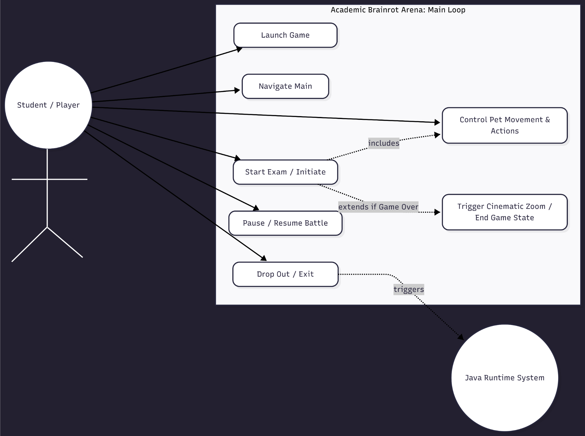
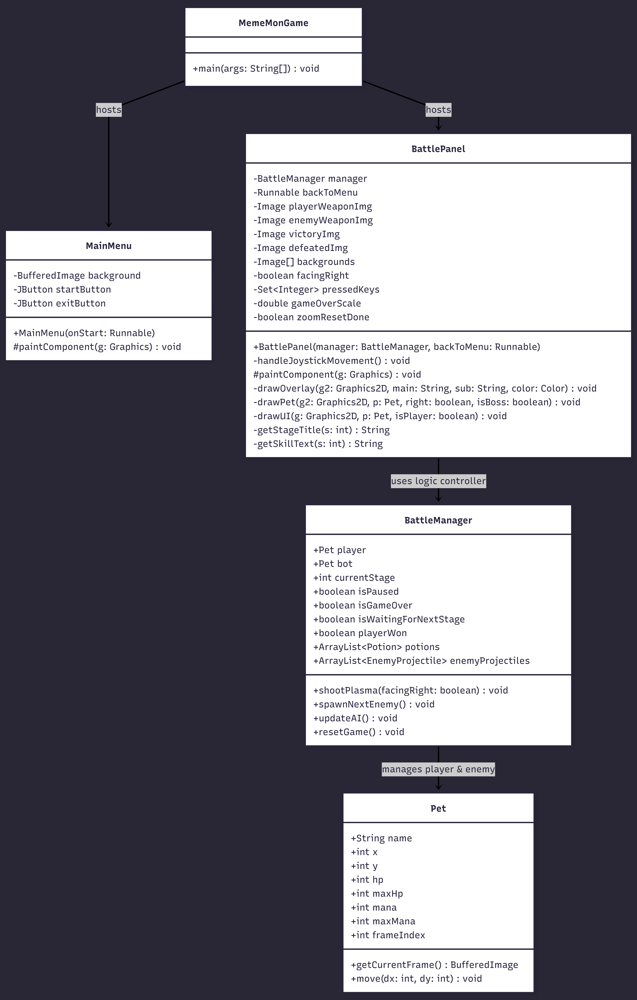

# Tekno Finals

Tekno Finals is a 2D Java game about surviving the semesters at CIT-U. Players control the CIT-U Wildcat, representing the student body, fighting through tough exams set by legendary teachers. Built using Object-Oriented Programming (OOP) principles, the game features a multi-stage boss system, 8-way movement, and custom teacher skills.

---

##  Features

* **4 Academic Stages:** Play through Prelim, Midterm, Pre-Final, and Finals against bosses: Contreras, Bolabola, Abadinas, and the final boss, Taboada.
* **Smooth 8-Way Movement:** Move smoothly in any direction. The character speed automatically adjusts to fit your monitor's resolution, so it feels the same on any screen.
* **Ranged Attacks:** Fire energy balls that travel the same way your character is facing.
* **Animated Game Over Screen:** When you win or lose, the victory or defeat banner zooms in smoothly from the center of the screen.
* **Teacher Boss Skills:**
  * **Contreras:** Heals himself slightly every 3 seconds.
  * **Bolabola:** Shoots projectiles in 4 directions after every 3 attacks.
  * **Abadinas:** Turns invisible for 2 seconds out of every 4 seconds.
  * **Taboada:** Gains a shield (damage immunity) and heals for 3 seconds out of every 4 seconds.
* **Items & Mana:** Use Mana to shoot projectiles. Pick up HP and Mana potions that drop near you every 4 seconds.
* **Sprite Animations:** Automatically cycles through Idle, Attack, and Hit sprite states based on what you are doing.

---

##  Controls

| Key | Action |
| :--- | :--- |
| **Arrow Keys** | 8-Way Movement (Up, Down, Left, Right, Diagonals) |
| **Spacebar** | Shoot Energy Ball (Costs 20 Mana) |
| **P** | Pause / Unpause the game |
| **Enter** | Next Stage (If you win) / Restart Level (If you lose) |
| **Escape** | Go back to the Main Menu (When Paused or Game Over) |

---

##  System Architecture

The project splits the game code up using OOP ideas to keep everything clean:

* **`Pet.java`:** The base class for all characters. It holds basic stats like health, mana, and changes the animation frames.
* **`BattleManager.java`:** The brain of the game logic. It manages stages, enemy spawns, potion drops, and checks if bullets hit targets.
* **`BattlePanel.java`:** Handles player inputs from the keyboard, draws the backgrounds, and displays the player HUD (HP/Mana bars).
* **`MainMenu.java`:** The home screen where you can click buttons to start the exam or exit the game.

### Use Case Diagram


### Class Diagram


---

## Getting Started

### Prerequisites

* Java JDK 17 or higher.
* An IDE (VS Code, IntelliJ IDEA, or Eclipse).

## Getting Started

### Prerequisites

* **Java JDK 17** or higher.
* An IDE (IntelliJ IDEA, Eclipse, or NetBeans).

### Installation

1. **Clone the repository:**
   ```bash
   git clone [https://github.com/Elessy1dfs/Meme-Mon-Brainrot-arena.git](https://github.com/Elessy1dfs/Tekno_Finals.git)


2. Verify Assets: Ensure the following .png files are in the root directory (not inside /src):

* **Bosses**: contreras.png, bolabola.png, abadinas.png, taboada.png.

* **Backgrounds**: prelim_bg.png, midterm_bg.png, prefinal_bg.png, final_bg.png, menu_bg.png.

* **Sprites/FX**: sigma_sheet.png, pencil.png, book.png, hp_potion.png, mana_potion.png.

* **Results**: victory.png, defeated.png.

3. Run the Game: Open the project in your IDE, compile, and execute MemeMonGame.java.


### Academic Context
Created as a final project for Object-Oriented Programming 2 (OOP2) at Cebu Institute of Technology – University.